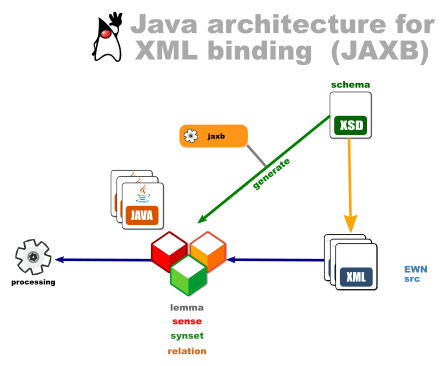

### Java Architecture for XML Binding (JAXB) for EWN XML schema

Provides access to English Wordnet (EWN) *src* files through Plain Old Java Object (Pojo) classes. The Java objects are generated from the XSD typed schema by the JAXB compiler, effectively **binding the objects to their XML** representation (or *unmarshalling* XML to Java objects).

It uses the **JAXB** framework which is one of the APIs in the Jakarta EE platform (formerly called Java EE).

Please refer to the test classes in the source files to get a glimpse as to how it can be used.

GroupID and ArtifactID on Maven Central:

for OEWN 2021, uses JAXB3

    <groupId>io.github.x-englishwordnet</groupId>
    <artifactId>ewn-jaxb</artifactId>
    <version>1.2.2</version>
    <name>EWN JAXB</name>

for OEWN 2020

    <groupId>io.github.x-englishwordnet</groupId>
    <artifactId>ewn-jaxb</artifactId>
    <version>1.0.1</version>
    <name>EWN JAXB</name>